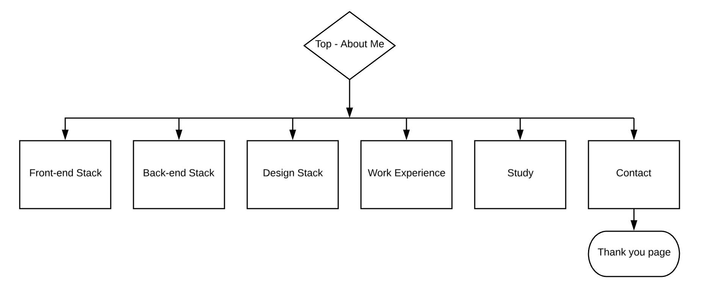
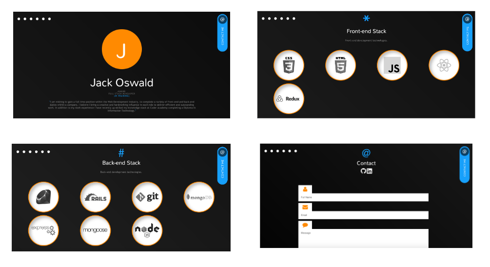
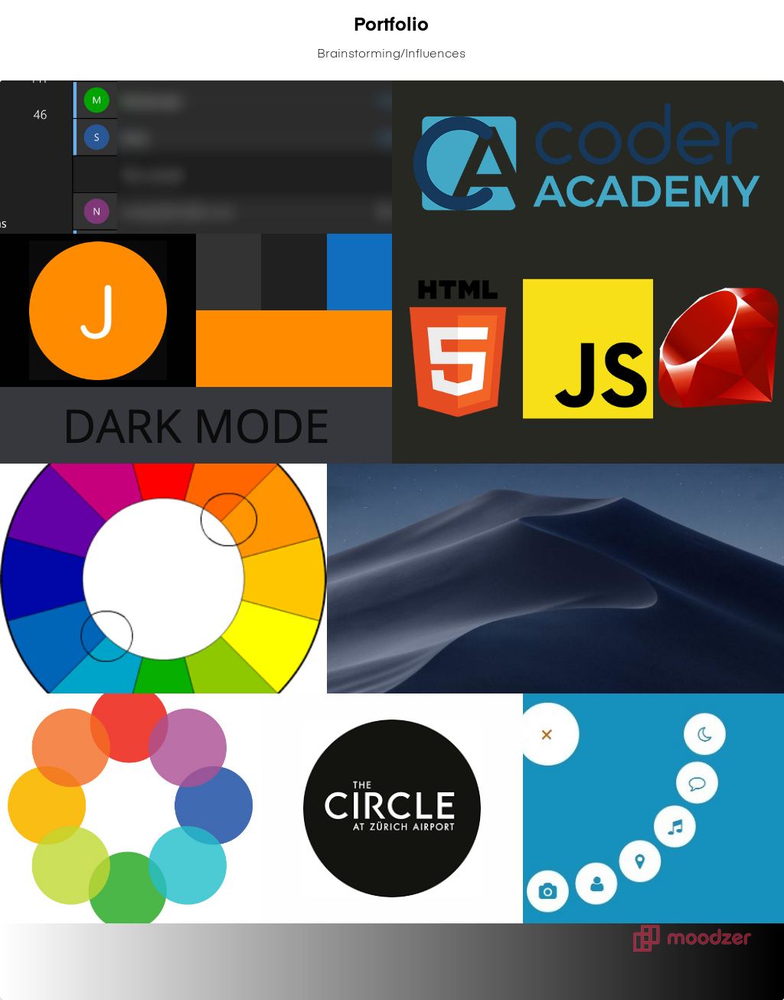
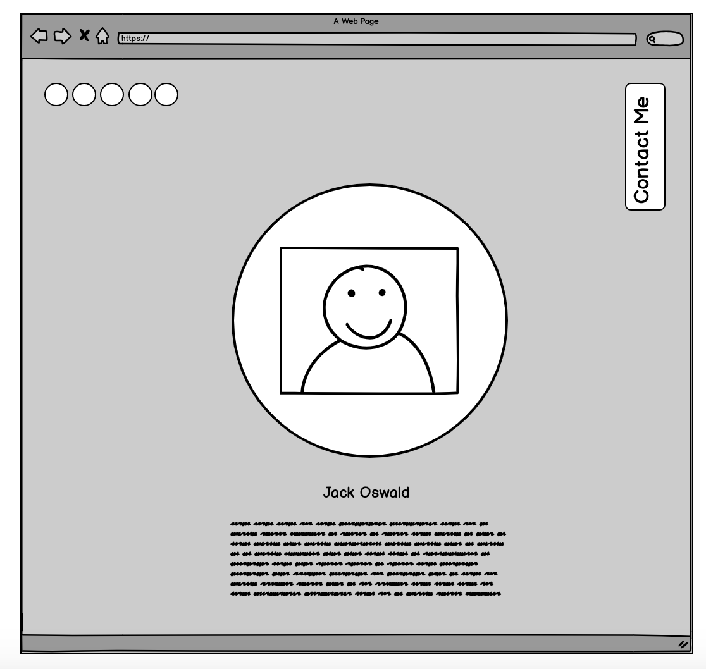
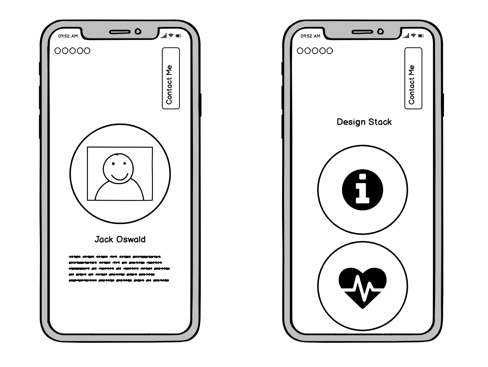
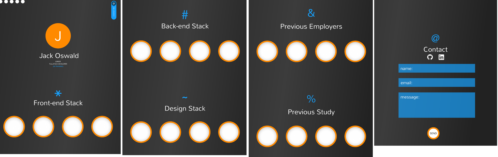
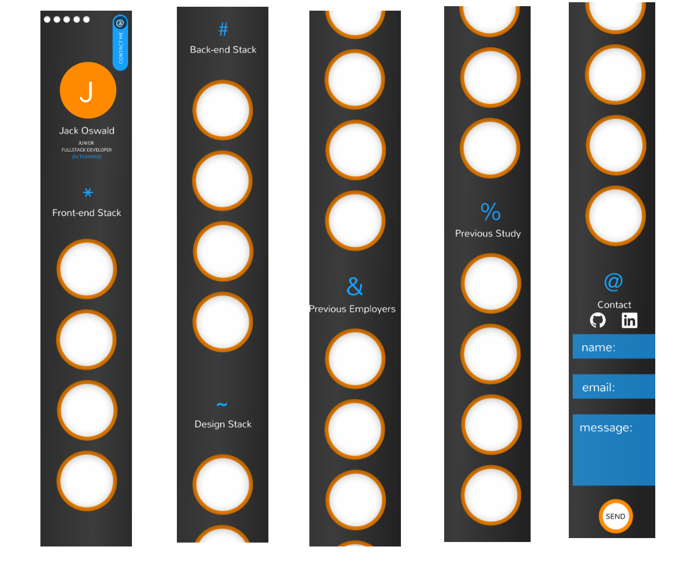
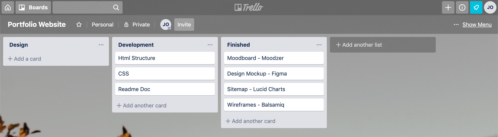

# Portfolio Website
## HTML & CSS

| | 
|-----------|
| Jack Oswald|

### Links

- http://www.jackoswald.dev
- https://github.com/jtrader/portfolio

# Contents

Table of Contents Here!

# Description

## Purpose
The purpose of my portfolio website is to effectively communicate to potential employers skills and attributes I have in a manner which is clear and concise whilst also visually stimulating. Utilizing design principles such as repitition as well as a strong complimentry color scheme and selected fonts, the site is purpose is to be easy to understand and deliver information which potential employers would be searching for. 

## Features
The site offers a small level of interaction as the black and white images are transitioned to color on the hover state. Navigation is performed using a circular bar which also provides a description of the links on hover. A link to contact me is present on all views encouraging potential employers to reach out via a contact form. The user has to option of using the navigation bar or simply scrolling down.

## Sitemap
This sitemap illustrates the different sections of my portfolio website.

## Screen shots

## Target Audience
My primary target audience is potential employers, site aims to illustrate profieciency in design, CSS and HTML by example. It also appeals to potential employers by listing additional technologies that potential employers would be looking for in an future employee.
## Tech Stack
Technologies used include CSS and HTML. In addition the contact form utilizes a third-party app called formspree.io. A few additional programs were used in the design process this included Figma, Moodzer and an online image editor.
# Design 

## Design Process

## Wireframes

## Personal Logo / Prototypes
Desktop prototype completed in Figma

iPhone prototype completed in Figma

## Usability Considerations

# Planning

## Process

## Trello Board

# Conclusion Q&A

### Describe key events in the development of the internet from the 1980s to today.

### Define and describes the relationship between fundamental aspects of the internet such as: domains, web servers, DNS, and web browsers.

### Reflect on one aspect of the development of internet technologies and how it has contributed to the world today.